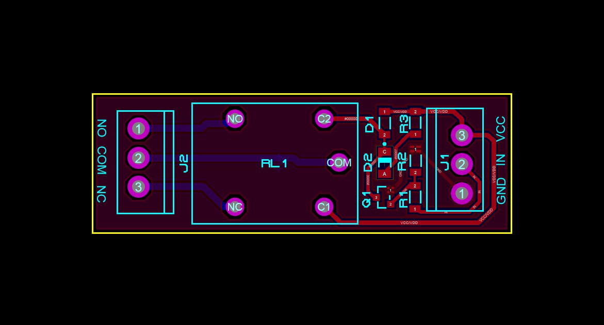
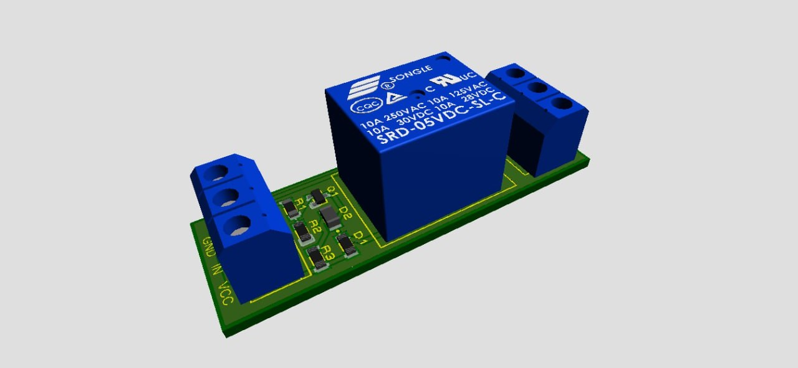
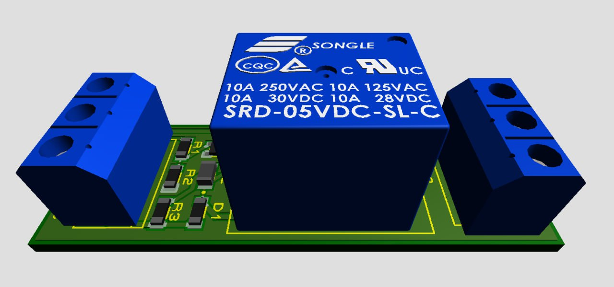

# Módulo de Relé de 5V SMD en Proteus

Este repositorio contiene el diseño completo de un **módulo de relé de 5V** con componentes de montaje superficial (SMD). El proyecto incluye los archivos de simulación en **Proteus 8.8**, el esquema eléctrico y el diseño de la placa de circuito impreso (PCB). Es ideal para quienes buscan diseñar módulos compactos y eficientes para proyectos de electrónica.

## 📝 Descripción del Proyecto

El diseño se centra en un **módulo de relé de 5V** activado por una señal digital. A diferencia de otros proyectos que utilizan optoacopladores, este diseño es más sencillo y compacto, lo que lo hace perfecto para aplicaciones donde el aislamiento no es crítico y el espacio es limitado. El módulo puede usarse para controlar cargas externas, como luces o motores pequeños, mediante una señal de bajo voltaje proveniente de un microcontrolador.

### Características Clave

* **Diseño SMD:** Utiliza componentes de montaje superficial para un tamaño compacto.
* **Relé de 5V:** Compatible con la mayoría de las señales de salida de microcontroladores.
* **Simulación en Proteus:** Incluye el esquemático y la simulación funcional.
* **Diseño de PCB:** Archivos para la fabricación de la placa de circuito impreso.
* **Ideal para Proyectos Compactos:** Perfecto para prototipos o dispositivos que requieren miniaturización.

## ⚙️ Lista de Componentes

Para replicar este proyecto, necesitarás los siguientes componentes.

| Category            | References | Value      |
| ------------------- | ---------- | ---------- |
| Diodes              | D1         | 1N4007     |
| Diodes              | D2         | LED-GREEN  |
| Miscellaneous       | J1-J2      | SIL-156-03 |
| Transistors         | Q1         | 2N3904     |
| Resistors           | R1-R2      | 2.7k       |
| Resistors           | R3         | 220        |
| Miscellaneous       | RL1        | G5CLE-1-DC5|

## 📸 Imágenes del Proyecto

### 1. Esquema Eléctrico

### 2. PCB

### 3. Vista Ortogonal

### 4. Vista Superior

---

## 🚀 Cómo usar este repositorio

1.  **Clona el repositorio:** `git clone https://github.com/ingwplanchez/proteus-relay-smd.git`
2.  **Abre el archivo de Proteus:** Navega a la carpeta del proyecto y abre el archivo `.pdsprj` con Proteus ISIS.
3.  **Ejecuta la simulación:** Presiona el botón de "Play" en Proteus para ver el circuito en acción.
4.  **Modifica el diseño:** Siéntete libre de experimentar con el diseño de la PCB o los valores de los componentes para adaptarlos a tus necesidades.